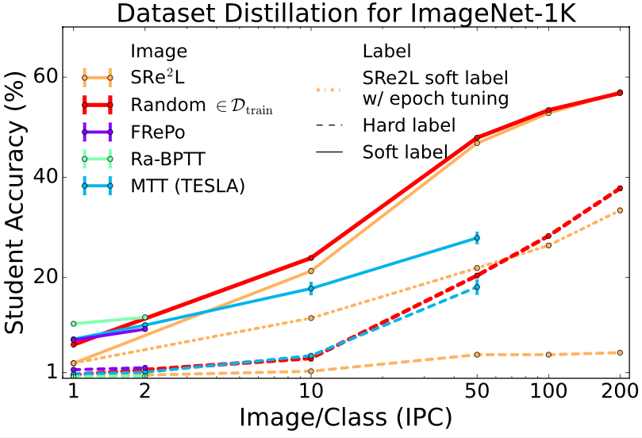
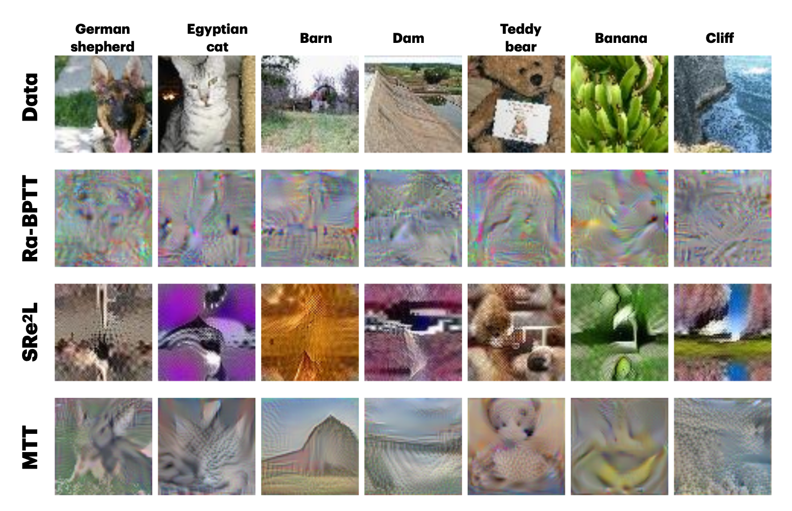
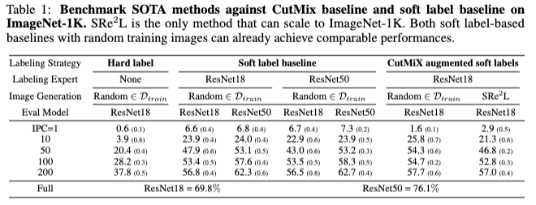
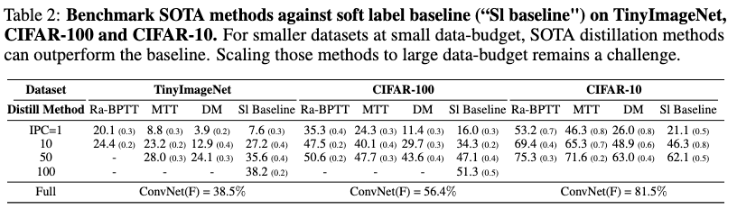
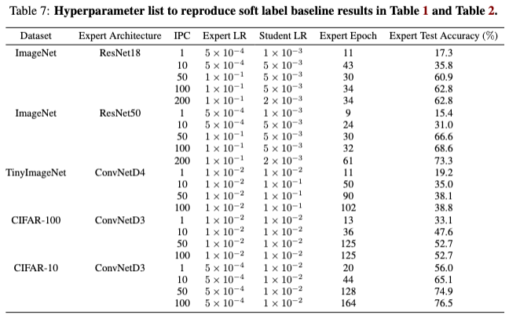

# 🏷️ A Label is Worth A Thousand Images in Dataset Distillation

This repository contains the official code for [A Label is Worth A Thousand Images in Dataset Distillation](https://arxiv.org/abs/2406.10485). 📝✨

<div align="center">
  
</div>


## 🛠️ Basic Setup

Make sure the following packages are installed in your environment:  

```bash
torch==1.13.1  
torchvision==0.14.1  
kornia==0.6.12  
einops==0.6.1  
numpy==1.20.1  
tqdm==4.64.1  
wandb==0.13.8  
scipy==1.10.1
```

📌 See `requirements.txt` for an exhaustive list of dependencies.


## 1️⃣ Generating Experts  

First, you need to generate expert models and save intermediate checkpoints. The relevant training scripts can be found in the `train_expert` folder.

### 🏋️ Training Expert Model on ImageNet  
```bash
torchrun --nproc_per_node=1 train.py --model=resnet50 --data-path=/PATH/TO/IMAGENET-1K/datasets/imagenet256 \
  -b=256 --lr=0.0005 --output-dir=/PATH/TO-SAVE/EXPERT/CHECKPOINTS/results_100_S \
  --print-freq=200
```

### 🏋️ Training Expert Model on TinyImageNet / CIFAR-10  
```bash
python buffer.py --dataset=Tiny --model=ConvNet --train_epochs=60 --num_experts=1  \
  --buffer_path=/PATH/TO-SAVE/EXPERT/CHECKPOINTS/results_100_S  --data_path=/PATH/TO/DATASET/data/tiny-imagenet-200 --save_interval 1
```

🔗 **You can also download my pretrained expert checkpoints** [here](https://drive.google.com/drive/folders/1tezdrL7YZVwBLhj8YubsuRjHrDEZ_rKA?usp=sharing).  


## 2️⃣ Training Student Model with Expert-Generated Soft Labels  

```bash
python nodistill.py --dataset=CIFAR100 --ipc=50 --expt_type=nothing  --teacher_label  \
  --max_expert_epoch=104 --lr_net=1.e-02  --expert_path=/PATH/TO-YOUR/EXPERT/CHECKPOINTS/results_100_S  \
  --data_path=/PATH/TO/DATASET/cifar100  --student_model=ConvNet \
  --teacher_model=ConvNet --epoch_eval_train 3000
```

### 🔑 Key Arguments:
* **`expt_type`**: Experiment type  
  - `nothing`: Default. Train a student network using expert labels.  
  - `tune_start`: Sweep through different expert checkpoints to find the best expert epoch.  
  - `tune_lr`: Tune student model learning rate.  
  - `other`: See code for more details.  

* **`teacher_label`**: Use soft labels generated by the expert (teacher).  
* **`max_expert_epoch`**: Which expert checkpoint to use (in `tune_start` mode, this argument indicates the max expert epoch to sweep).  
* **`student_model`**: Student model architecture.  
* **`teacher_model`**: Teacher model architecture.  
* **`epoch_eval_train`**: Number of training epochs for the student network.  


## Main Results  

<div align="center">
   
   
</div>


## Key Hyperparameters  

<div align="center">
  
</div>


## 🔄 Full Reproducibility  

📌 See `sample_scripts.md` for an extensive list of commands used to reproduce all experiment results reported in the paper.  


### 🚀 Feel free to reach out if you have any questions! 🎉  


